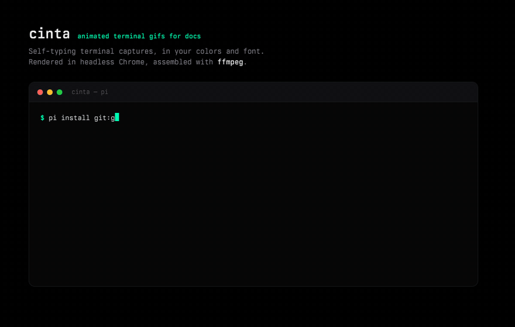

# cinta

Animated terminal-capture GIFs for documentation — from inside pi. The agent
writes the terminal script conversationally, you get a self-typing GIF in your
colors and font.



## Install

```bash
pi install git:github.com/sainzs/cinta
```

Requires Chrome (`brew install --cask google-chrome`) and `ffmpeg`
(`brew install ffmpeg`). No API keys, no accounts — Chrome runs headless
locally and the GIF never leaves your machine.

## What it does

- Adds a `cinta` tool the agent calls with a terminal script (commands, output,
  streamed lines)
- Renders the script as a self-typing terminal session — Berkeley Mono Variable,
  pure black `#000000`, mint `#00ffb2` (all overridable)
- Records it frame-by-frame in headless Chrome and assembles an optimized,
  infinite-loop GIF with ffmpeg
- Adds `/cinta <text>` so you can ask for a GIF without waiting for the agent
  to decide
- Writes `hero.html` (the regenerable source) next to every GIF

## Usage

Ask for one in conversation:

```text
make a cinta GIF of the install command and the model list, save to assets/
```

or drive it directly:

```text
/cinta npm test passing, all 41 tests green
```

The tool's script vocabulary:

| Step | Shape | Renders as |
|------|-------|------------|
| `cmd` | `{ "type": "cmd", "text": "npm test" }` | typed character-by-character after a `$` |
| `out` | `{ "type": "out", "text": "…", "cls": "ok" }` | one output block (`ok` = mint) |
| `stream` | `{ "type": "stream", "lines": ["…"] }` | lines appearing one at a time |
| `gap` | `{ "type": "gap" }` | vertical breathing room |
| `done` | `{ "type": "done" }` | final mint block + blinking cursor |

## Options

`width`, `height`, `fps` (default 12), `scale` (default 880px wide), plus
`colors` and `font` overrides. Timing constants (`typeMs`, `lineMs`,
`afterCmdMs`, `endHoldMs`) tune the pacing.

## How it works

The script is replayed in a styled HTML page (not a real terminal — that's what
makes it deterministic and stylable), screenshotted per frame by headless
Chrome, and assembled into a GIF with a two-pass ffmpeg palette. Same approach
as the `augment-ai-provider` hero, packaged as a tool.

## License

MIT
